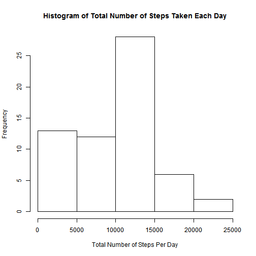

# Reproducible Research: Peer Assessment 1


## Loading and preprocessing the data
Here we are going to load the activity data


```r
filename <- "activity.csv"
data <- read.csv(filename, header = TRUE, na.strings = "NA")
```

## What is mean total number of steps taken per day?

Here, we calculate the total number of steps taken per day

```r
## Calculate total number of steps taken per day
SumOfStepsPerDay <- tapply(data$steps, as.factor(data$date), sum, na.rm = TRUE)
```

1. Make a histogram of the total number of steps taken each day

```r
## Make a histogram of the total number of steps taken each day
hist(SumOfStepsPerDay, main = "Histogram of Total Number of Steps Per Day", xlab = "Total Number of Steps Per Day")
```

 

2. Calculate mean and median of the total number of steps taken each day

```r
## Calculate mean and median of the total number of steps taken each da
MeanStep <- mean(SumOfStepsPerDay)
MedianStep <- median(SumOfStepsPerDay)
MeanStep
```

```
## [1] 9354
```

```r
MedianStep
```

```
## [1] 10395
```


Thus, the mean of the total number of steps taken each day is 9354.2295 and the median of the total number of steps taken each day is 10395.


## What is the average daily activity pattern?

Here, we calculate the average number of steps taken in the 5-minutes interval

```r
AverageSteps <- tapply(data$steps, as.factor(data$interval), mean, na.rm = TRUE)
```

1. Make a time series plot


```r
Interval <- unique(data$interval)
plot(Interval, AverageSteps, type = "l", main = "Average Number of Steps Taken in 5-minute Interval", xlab = "Interval", ylab = "Average Number of Steps")
```

 

2. Find the 5-minute interval contains the maximum number of steps on average across all the days in dateset


```r
idx <- which(AverageSteps == max(AverageSteps))
MaxInt <- Interval[idx]
MaxInt
```

```
## [1] 835
```

Thus, the 5-minute interval, which contains the maximum number of steps, is 835.

## Imputing missing values

1. Calculate and report the total number of missing values in the dataset with the avrage


```r
Len <- length(which(is.na(data$steps)))
Len
```

```
## [1] 2304
```

Total number of missing values in the date set is 2304

2. Devise a strategy for filling in all of the missing values in the dataset.

I used the average number of steps taken in the 5-minutes interval to fill in the missing values. There are three steps to implement this strategy:

* Determine the intervals for corresponding NA steps

* Find the average number of steps for this interval based on previous calculation

* Fill in the steps of NAs with the values found in the second step

The specific implementation code is shown below.


3. Create a new dataset that is equal to the original dataset but with the missing data filled in


```r
## Find the intervals of the respective NAs in steps
Ints <- data$interval[is.na(data$steps)]

## Find the average number of the steps in the corresponding intervals
MyFun <- function(x){
  return (AverageSteps[which(Interval == x)])
}

## Create the vector of the values(average steps of the corresponding interval) to replaceaccording to the intervals of NAs.
values_to_replace <- lapply(Ints, MyFun)

## Replace the NAs with the new value
data_new <- data
data_new$steps[is.na(data_new$steps)] <- values_to_replace
```

4.1 Make a histogram of the total number of steps taken each day


```r
TotalSteps <- tapply(as.numeric(data_new$steps), as.factor(data_new$date), sum)
hist(TotalSteps, main = "Histogram of Total Number of Steps Taken Each Day", xlab = "Total Number of Steps Per Day")
```

 


4.2 Calculate and report the mean and median total number of steps taken per day

```r
MeanStep_new <- mean(TotalSteps)
MedianStep_new <- median(TotalSteps)
MeanStep_new
```

```
## [1] 10766
```

```r
MedianStep_new
```

```
## [1] 10766
```

The mean of total number of steps taken per day is 1.0766 &times; 10<sup>4</sup> and the median is 1.0766 &times; 10<sup>4</sup>.

Based on the results, we can find:

* For first part: Mean = 9354.2295 and Median = 10395

* For this part: Mean = 1.0766 &times; 10<sup>4</sup> and Median = 1.0766 &times; 10<sup>4</sup>

Thus, the means and medians for the two cases are different. However, for in the second case, the mean equals to the median. So we can see that imputing missing values eliminated the bias that we can use either the mean or the median to estimate the total daily number of steps.

## Are there differences in activity patterns between weekdays and weekends?

1. Create a new factor variable in the dataset with two levels - "weekday" and "weekend" indicating whether a given date is a weekday or weekend day.


```r
## Find the according weekday of the given date
day <- weekdays(as.Date(as.character(data_new$date)))

## Decide whether it's weekday or weekend
weekday <- as.factor(ifelse(day %in% c("Saturday","Sunday"), "Weekend", "Weekday"))

## Create a new data frame with the factor variable
data_new <- data.frame(data_new, weekday)
```

2. Make a panel plot containing a time series plot of the 5-minute interval (x-axis) and the average number of steps taken, averaged across all weekday days or weekend days (y-axis). 


```r
attach(data_new)
```

```
## The following object is masked _by_ .GlobalEnv:
## 
##     weekday
```

```r
data_new$steps <- as.numeric(data_new$steps)
aggdata <-aggregate(data_new$steps, by=list(interval,weekday), FUN=mean, na.rm=TRUE)

colnames(aggdata) <- c("interval", "weekday", "steps")

library(ggplot2)
```

```
## Warning: package 'ggplot2' was built under R version 3.1.1
```

```r
qplot(interval, steps, data=aggdata, facets = weekday~., geom = "line",main = "Average Number of Steps Taken in 5-minute Interval", xlab = "Interval", ylab = "Average Number of Steps")
```

 
